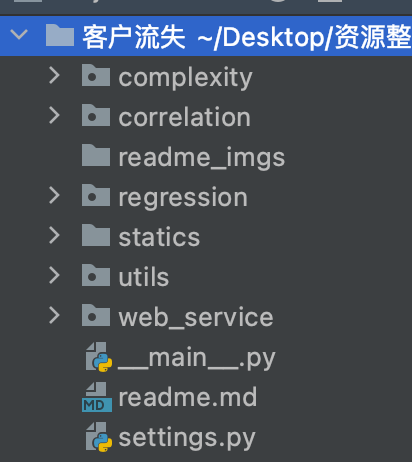
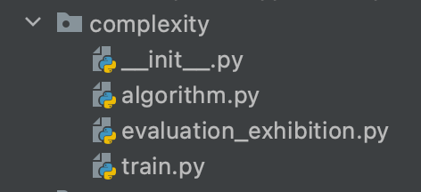
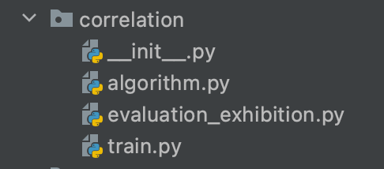
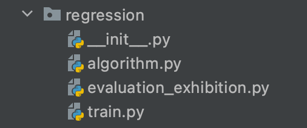
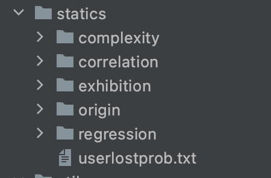
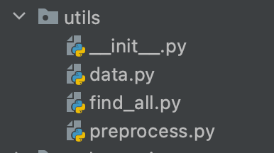

# Pandas 进阶修炼：客户流失分析案例

### 一. 项目介绍：

* 项目以本人之前过往工作，以项目交付标准，利用部分机器学习与复现算法，实现部分需求。项目背景介绍参见项目目录下的`「客户流失分析」案例实战.ipynb`，路径如下：

  ```
  客户流失/statics/origin/「客户流失分析」案例实战.ipynb
  ```

### 二. 项目功能：

* 本项目实现了如下功能：
  
  1. 预处理策略：对于单一字段的缺失值的均值填充。
  
  2. 通过 settings.py 配置实现字段相关性检验，并以弦图展示，涉及相关性算法：
  
     * peason 相关性系数（自实现）
  
  3. 通过 settings.py 配置实现字段一对一回归拟合，并以折线图展示，回归拟合算法：
  
     * 监督模型：
       * 决策树回归模型（sklearn）。
       * 随机梯度下降模型（sklearn）。
       * 随机森林模型（sklearn）。
       * adaboost 模型（sklearn）。
       * 二次多项式回归模型（sklearn）。
     * 无监督模型：
       * 传统卡尔曼滤波（自变量维度可扩展，pykalman）
  
  4. 通过 settings.py 配置实现单一算法策略评估，并以柱状图展示，策略评价算法：
  
     * Rademacher 算子空间复杂度（回归版，自实现）。
  
       

### 二. 项目目录：

本项目的核心目录为：



其中，各功能以可调用的 `python` 目录的形式并列于项目的根目录中，具体目录结构见下：

1. 算子空间复杂度算法实现，训练，预测与展示子目录：

   

2. 相关性分析子目录：

   

3. 回归分析目录：

   

4. 静态文件目录：

   

5. 公共组件目录：

   


### 三. 项目目录明细

| 名称          | 类型          | 功能                                                 |
| ------------- | ------------- | ---------------------------------------------------- |
| `correlation` | python 包     | 相关性系数分析核心目录                               |
| `regression`  | python 包     | 回归分析核心目录                                     |
| `complexity`  | python 包     | `Rademacher` 算子空间复杂度分析核心目录              |
| `statics`     | 静态目录      | 模型，分析展示结果 `html, excel`，等静态文件存放目录 |
| `utils`       | python 包     | 全局公共组件目录                                     |
| `settings.py` | `py 文件`     | 全局配置文件                                         |
| `__main__.py` | `py` 文件     | 全局入口文件                                         |
| `readme.md`   | markdown 文件 | 项目使用介绍文件                                     |

### 四. 运行与相关结果获取流程

1. 在 `settings.py` 中配置相关信息：

   ```python
   import pathlib
   
   # 项目根目录
   BASE_DIR = pathlib.Path(__file__).parent  
   
   # mysql 配置项（如通过 utils.data.Dataloader.data_to_sql() 方法对 txt 文件数据进行 mysql 导入，则需要配置此项）。
   MYSQL_CONFIG = {  
       "user": "xxx",
       "password": "xxx",
       "host": "xxx",
       "port": 3306,
       "db": "xxx",
   }
   
   
   # 需预处理的字段配置项：字典数组类型（缺失值处理方式目前仅支持均值填充）。
   # {
   #		"title": 字符串类型：字段标题,
   #   "flag":  字符串类型：字段预处理方式：
   #			  ‘mean’：均值填充,
   #   "method": 字符串数组类型：非空数据预处理操作：
   # 			‘quartile’: 四分位去极端值；
   #			  ‘int_float’: X.0 型数字转化；
   #       ‘float’: 浮点型数字转化；
   #       ‘int’: 整型数字转化
   # }
   FILLING_COLUMNS = [
       {
           "title": "decisionhabit_user",  
           "flag": "mean",  
           "method": ["quartile", "int_float"]   
       },
       {
           "title": "ordercanceledprecent",
           "flag": "mean",
           "method": ["float"]
       },
       {
           "title": "commentnums",
           "flag": "mean",
           "method": ["int"]
       },
       {
           "title": "visitnum_oneyear",
           "flag": "mean",
           "method": ["int"]
       },
       {
           "title": "lastpvgap",
           "flag": "mean",
           "method": ["int"]
       },
       {
           "title": "starprefer",
           "flag": "mean",
           "method": ["float"]
       },
       {
           "title": "landhalfhours",
           "flag": "mean",
           "method": ["int_float", "quartile"]
       },
       {
           "title": "lowestprice_pre2",
           "flag": "mean",
           "method": ["int_float"]
       },
       {
           "title": "cityorders",
           "flag": "mean",
           "method": ["float", "quartile"]
       },
       {
           "title": "cityuvs",
           "flag": "mean",
           "method": ["float", "quartile"]
       }
   ]
   
   # 回归分析字段配置项：字典数组类型。
   # {
   #		"title_x": 字符串类型：横坐标字段标题,
   #   "title_y": 字符串类型：纵坐标字段标题
   # }
   REGRESSION_COLUMNS = [
       {
           "title_x": "starprefer",
           "title_y": "lowestprice_pre2",
       },
       {
           "title_x": "cityorders",
           "title_y": "cityuvs",
       }
   ]
   
   # 空间复杂度分析配置项：字典数组类型（目前仅支持对于 sklearn 中机器学习算法的复杂度分析）。
   # {
   #		"title": 字符串类型：算法标题（必须与 sklearn 中对应类名一致）
   #		"title_x": 字符串类型：横坐标字段名称
   #		"title_y": 字符串类型：纵坐标字段名称
   #   "policy":  字典类型：参数字典（key 值必须与 一致）：
   #			  {
   #          key: 字符串类型：sklearn 中实例化对象的初始化形参,
   #          value: 列表类型：title 算法中 key 所支持的参数列表
   #       }
   # }
   POLICY_VERIFICATION = [
       {
           "title": "RandomForestRegressor",
           "title_x": "cityorders",
           "title_y": "cityuvs",
           "policy": {
               "random_state": [1, 2, 3, 4, 5],
               "n_estimators": [64, 81, 100]
           }
       },
       {
           "title": "DecisionTreeRegressor",
           "title_x": "cityorders",
           "title_y": "cityuvs",
           "policy": {
               "splitter": ["best", "random"],
               "min_samples_split": [0.5, 2, 3],
               "random_state": [1, 2, 3, 4],
           }
       }
   ]
   
   # 全局开关控制器配置
   TOTAL_CONTROLLER = {
       "regression": {  # 回归分析控制器
           "trainer": False,  # 训练逻辑开关
           "evaluator_exhibitor": False  # 预测与展示逻辑开关
       },
       "correlation": {  # 相关性分析控制器
           "trainer": False,
           "evaluator_exhibitor": False
       },
       "complexity": {  # 空间复杂度算法验证控制器
           "trainer": True,
           "evaluator_exhibitor": True
       }
   }
   
   ```

   

3. 将 `settings.py` 中的全局开关控制器中，所需要运行的逻辑对应位置修改为 True，运行并等待 `base/__main__.py` ，同时，以实现对应功能。

   * Remark：注意每一组分析逻辑中，训练与展示逻辑 `evaluator_exhibitor`需保证 `/statics/逻辑/models` 下必须存在历史训练模型，否则，请将对应的训练逻辑优先级提前。

     

### 五. 模型，展示文件导出格式

##### 1. 字段相关性分析：

* 训练模型文件名：

  ```
  相关性算法类名-横坐标字段-纵坐标字段.pkl
  ```

* 弦图展示文件名：

  ```
  correlation.html 
  ```

##### 2. 回归分析：

* 训练模型文件名：

  ```
  回归算法类名-横坐标字段-纵坐标字段.pkl
  ```

* 折线图展示文件名：

  ```
  回归算法类名-横坐标字段-纵坐标字段.html
  ```

##### 3. 算子空间复杂度分析：

* 训练模型文件名：

  ```
  回归算法类名-横坐标字段-纵坐标字段-算法参数字典 md5 加密字符串.pkl
  ```

* 柱状图展示文件名：

  ```
  complexity.html
  ```

* Excel 统计表展示文件名：

  ```
  complexity.xlsx
  ```

  


### 六. 所涉及到的算法

**本部分仅介绍算法部分实现公式以及相关改良及其推广部分，具体算法实施细节请参见百度或 `csdn`**

* 字段相关性算法：

  * `pearson` 相关性算法：

  $$
  \begin{eqnarray*}
  	C_{pearson} = \frac{E[(\bar{x} - E(\bar{x}))\cdot (\bar{y} - E(\bar{x}))]}{\sqrt{E[(\bar{x} - E(\bar{x}))^{2}]}\cdot \sqrt{E[(\bar{y} - E(\bar{y}))^{2}]}}
  \end{eqnarray*}
  $$

  

* 回归算法：（每种回归算法公式很多，由于本项目使用 sklearn 等算法库进行算法实现，因此并无改动或推广，细节请参见百度与相关书籍）

  1. `DecisionTreeRegressor` 决策树回归；
  2. `PolynomailRank2Regression` 二次多项式回归
  3. `ARDRegression` 随机梯度下降；
  4. `RandomForestRegressor` 随机森林回归（base 决策树）；
  5. `AdaBoostRegressor` `adaboost` 回归（base 决策数）；
  6. 可拓展维度 `kalman` 滤波拟合；

  

* `Rademacher` 空间复杂度算法（推广的回归模式）：
  $$
  \begin{eqnarray*}
  	&&R(\mathscr{F}) = E_{\epsilon \in H}[\sup_{f \in \mathscr{F}} \frac{1}{n}\sum_{i=1}^{n}I(|f(x_{i}) - y_{i}| > \epsilon)]，H = \{\epsilon_{1}, \epsilon_{2},\cdots\}\\
  	&&其中：I(|f(x_{i}) - y_{i}| > \epsilon) = \begin{cases}
  		1, & |f(x_{i}) - y_{i}| > \epsilon, \\
  		0, & |f(x_{i}) - y_{i}| <= \epsilon
      \end{cases}\\
  \end{eqnarray*}
  $$

  * Remark：这里对原有的 `Rademacher` 空间复杂度做了个推广，现阶段能查到的复杂度是基于分类任务的，而对于分类任务中，内部的标识函数 I 就可改写成下面这个样子：
    $$
    \begin{eqnarray*}
    	I(f(x_{i}) \neq y_{i}) \equiv \frac{1 - y_{i}h(x_{i})}{2}
    \end{eqnarray*}
    $$
    而上面的改写方法，是参照了 `SVM` 对 `SVR` 的损失进行的推广，即将分类任务中的分类异常，修改成了回归任务中的偏差异常：
    $$
    \begin{eqnarray*}
    	I(f(x_{i}) \neq y_{i}) \rightarrow I(|f(x_{i}) - y_{i}| > \epsilon)
    \end{eqnarray*}
    $$
    以同一个算法的不同参数策略看作一个 f 函数，则可对于同一算法，所有不同策略进行空间复杂度计算，从而根据结果评价算法的拟合度之优劣。 `Rademacher` 空间复杂度回归模式所计算的值，同样在于区间 `[0, 1]`，值越小，复杂度越低，训练效果越接近真实数值，拟合效果越好。
    
    

### 七. 项目使用相关依赖：

* `python`  ==  3.9.5
* `numpy`  ==  1.22.4
* `pandas` ==  1.2.4
* `apscheduler` ==  3.7.0
* `sklearn` ==  0.24.2
* `sqlalchemy` == 1.4.17
* `pyg2plot` == 0.1.8
* `scipy` == 1.6.1
* `pykalman` == 0.9.5


